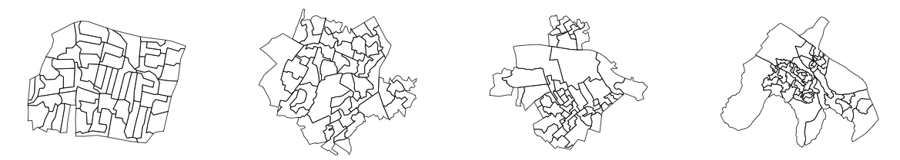
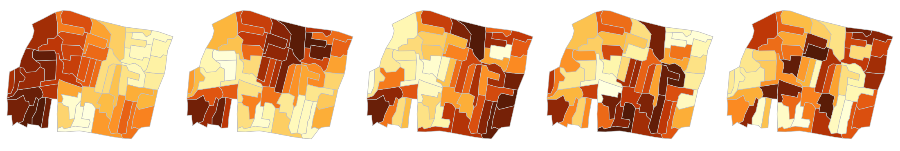
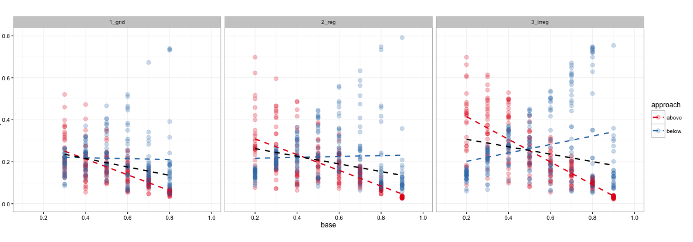
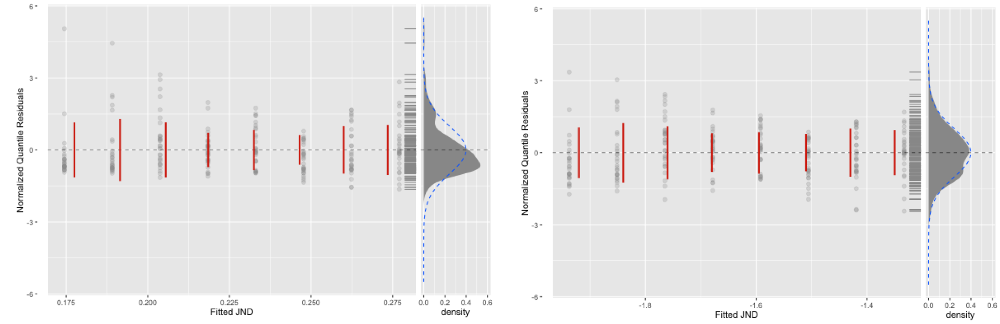
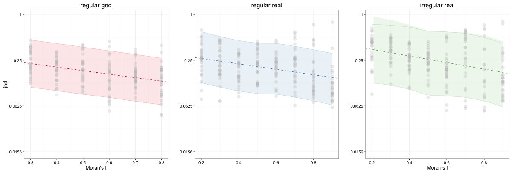

# Supplementary details for _Map LineUps: effects of spatial structure on graphical inference_

_Roger Beecham_ (contact [r.j.beecham@leeds.ac.uk](mailto:r.j.beecham@leeds.ac.uk)) <br>
_Jason Dykes_ <br>
_Wouter Meulemans_ <br>
_Aidan Slingsby_ <br>
_Cagatay Turkay_ <br>
_Jo Wood_ <br>

This document contains supplementary information for our paper, [_Map LineUps: effects of spatial structure on graphical inference_](http://www.gicentre.net/maplineups).  It outlines the procedure for the experiment (on which the paper is based), code that can be used to run the experiment locally and code used in the data analysis. Note that this draws heavily on work  published in [Harrison _et al._](https://github.com/TuftsVALT/ranking-correlation) and  [Kay & Heer](https://github.com/mjskay/ranking-correlation).


## Experiment

Below is some code and discussion of how we generate the stimuli used in the experiment. The survey software can be found in [experiment/](experiment). Instructions for trying this locally are at the end of this section.  

All stimuli used in the experiment were created using R.  

### Configure R

The following libraries are required for generating the maps used as stimuli.

```r
# For spatial data handling
library(rgdal)
library(rgeos)
library(spdep)
library(gtools)
library(spatstat)
library(FNN)
# For charting
library(tmap)
library(ggplot2)
library(gridExtra)
# For data munging
library(magrittr)
library(dplyr)
```

### Load shapefiles

```r
source("src/load_shapefiles.R")
```


### Generating _real_ study regions

Motivating our study is the need to evaluate Wickham _et al_'s line-up protocol when applied to choropleth maps. We want to come up with recommendations for constructing line-up tests in _real_ data analysis scenarios. So we want ecological validity in the stimuli we create. Because of this, we believe there's a strong argument for using real geographic regions as well as testing against more contrived situations (e.g. regular grids).

Below are two approaches to generating these _real_ regions using English Output Areas (OAs):

1. Load a SpatialDataFrame containing all OAs, sample an OA, then find its 50 nearest neighbours.
2. Load a spatial data frame containing all Middle Super Output Areas (MSOAs). MSOAs contain on average 25 OAs. Sample an MSOA and find its nearest neighbour -- thus we end up with c. 50 geographic units, but their grouping is more _real_ since MSOAs are a genuine administrative geography.

Next, we need to decide on different geometries of these regions to use in the testing. We want to see if ability at performing line-up tests varies with regions of increasingly irregularity. But we again want these definitions of irregular geometry to be plausible. One approach may be to find this distribution of plausible regions empirically: generate c.1000 regions using approach 2, calculate summary statistics on these and sample from different parts of this distribution.

The two summary statistics we explored are Coefficient of Variation in area and Nearest Neighbour Index (NNI).

```r
# Function for exploring study regions of varying geography
find.geography <- function(england_msoas, msoas, england_OAs, coef_var_min, coef_var_max, nni_min, nni_max, calculate_coef_var)
{
  repeat
  {
    sample_msoa <- england_msoas[sample(england_msoas@data$row, 1),]
    sample_msoas <- england_msoas@data[get.knnx(coordinates(england_msoas),coordinates(sample_msoa), k=2)$nn.index,]
    sample_OAs <- msoas[which( msoas$msoa %in% sample_msoas$msoa ),]
    if(nrow(sample_OAs)>0)
    {
      sample_geoms <- england_OAs[england_OAs@data$CODE %in%  sample_OAs$oa,]
      centroids <- gCentroid(sample_geoms, byid=TRUE)
      nni<- mean(nndist(centroids@coords))/(0.5*sqrt(gArea(sample_geoms, byid=FALSE)/length(sample_geoms@data$row)))
      coef_var <- sd(gArea(sample_geoms, byid=TRUE)/1000/1000)/mean(gArea(sample_geoms, byid=TRUE)/1000/1000)
      if(calculate_coef_var)
      {
          if(coef_var > coef_var_min && coef_var < coef_var_max && length(sample_geoms) > 44 && length(sample_geoms) < 56 )
          {
            sample_geoms@data$row<-1:length(sample_geoms)
            return(sample_geoms)
            break
          }
      }
      else
      {
        if(nni > nni_min && nni < nni_max && length(sample_geoms) > 44 && length(sample_geoms) < 56 )
        {
            sample_geoms@data$row<-1:length(sample_geoms)
            return(sample_geoms)
            break
        }
      }
    }
  }
}
regular <- find.geography(england_msoas, msoas, england_OAs, 0, 0.5, NULL, NULL, TRUE)
less_regular <- find.geography(england_msoas, msoas, england_OAs, 0.9, 1.0, NULL, NULL, TRUE)
irregular <- find.geography(england_msoas, msoas, england_OAs, 1.3, 1.4, NULL, NULL, TRUE)
more_irregular <- find.geography(england_msoas, msoas, england_OAs, 1.8, 1.9, NULL, NULL, TRUE)
par(mfrow=c(1,4))
plot(regular)
plot(less_regular)
plot(irregular)
plot(more_irregular)
```


### Generating autocorrelated maps

We first define a function for generating synthetic attribute data: rectangular distributions in this case.

```r
create.attribute.data <- function(data)
{
  data@data$value <- NULL
  nrows <- nrow(data@data)
  temp <- data.frame(matrix(ncol = 2, nrow = nrows))
  temp[,1] <- 1:nrows
  dist <- runif(nrows, min=1, max=10)
  temp[,2] <- dist
  colnames(temp) <- c("index","value")
  temp[,1] <- data@data$CODE
  colnames(temp) <- c("CODE","value")
  data@data <- merge(data@data, temp, by="CODE")
  return(data)
}
```
Next we develop a function for creating maps with a stated [Moran's _I_](http://link.springer.com/referenceworkentry/10.1007%2F978-0-387-35973-1_817). The simplest means is the permutation based approach used in [Wickham _et al._](http://ieeexplore.ieee.org/xpl/articleDetails.jsp?arnumber=5613434). The problem is that this becomes very slow where we wish to generate even moderate Moran's _I_. An alternative option (more of an edit): randomly pick pairs of OAs, swap the attribute values and if difference in _I_ to the target Moran's _I_ decreases, keep the values swapped.

```r
generate.map <- function(data, min, max)
{
  data_nb <- poly2nb(data)
  data_dsts <- nbdists(data_nb, coordinates(data))
  idw <- lapply(data_dsts, function(x) 1/x)
  data_lw <- nb2listw(data_nb, glist = idw)
  repeat
  {
    # Start with a new permutation
    permutation <- data@data[sample(nrow(data@data)),]
    i_now <- moran.test(permutation$value, data_lw)$estimate[1]
    i_old <- i_now
    d_old <-NULL
    d_old <- sqrt((i_now-max)^2)
    # If after 5000 attempts, still not reached desired Moran's I, then try a new permutation.
    for(j in 1:5000)
    {
      # Break if reached desired I.
      if(i_now >= min && i_now < max)
      {
        break
      }  
      # Sample two distinct positions  
      swap_index <- sample(1:nrow(permutation),2, replace=FALSE)
      # Get values corresponding to these positions
      swap_values <- sapply(swap_index,function(row_index){return(permutation$value[row_index])})
      # Swap the values
      permutation$value[swap_index[1]]<-swap_values[2]
      permutation$value[swap_index[2]]<-swap_values[1]
      # Calculate new Moran's I  
      i_now <- moran.test(permutation$value, data_lw)$estimate[1]
      d_now=sqrt((i_now-max)^2)
      # Revert back if it's not reduced distance to targets
      if(d_now < d_old)
      {
       i_old <- i_now
       d_old <- d_now
      }
      else # Revert if no nearer target
      {  
        i_now<-i_old
        permutation$value[swap_index[1]]<-swap_values[1]
        permutation$value[swap_index[2]]<-swap_values[2]
      }
    }
    #break if reached desired I.
    if(i_now > min && i_now <=max)
    {
      break
    }  
  }
  data@data <- cbind(data@data,permutation$value);
  colnames(data@data)[4] <- "permutation"
  # Draw maps
  map <- tm_shape(data) +
    tm_fill(c("permutation"),style="cont", palette="YlOrBr")+
    tm_borders(col="gray80", lwd=1)+
    tm_layout(legend.show=FALSE,frame=FALSE)
  return(map)
}
```

```r
regular <- create.attribute.data(regular)
map1 <- generate.map(regular, 0.9,0.91)
map2 <- generate.map(regular, 0.7,0.71)
map3 <- generate.map(regular, 0.5,0.51)
map4 <- generate.map(regular, 0.3,0.31)
map5 <- generate.map(regular, 0.1,0.11)
library(grid)
grid.newpage()
pushViewport(viewport(layout=grid.layout(1,5)))
print(map1, vp=viewport(layout.pos.col=1))
print(map2, vp=viewport(layout.pos.col=2))
print(map3, vp=viewport(layout.pos.col=3))
print(map4, vp=viewport(layout.pos.col=4))
print(map5, vp=viewport(layout.pos.col=5))
```


R scripts for generating maps in the directory structure used by our survey software can be found in [src/](src/): ```generate_tests.R```.

### Trying the survey

You will need to install [_MySQL_](https://dev.mysql.com/usingmysql/get_started.html) and  [_MAMP_](https://www.mamp.info/en/) -- the latter of which  enables _PHP_ and _MySQL_ to be run locally. After installing _MAMP_, select ```preferences```, ```web server``` and navigate to ```../experiment/```. After ```start servers```, open a browser and enter ```localhost:8888/admin_initialize.php```. As well as creating the _MySQL_ dbase (called _maplineups_) and required tables, this reads the pushed sample maps stored as .png files in [tests/](experiment/tests/) and creates a ```../stimuli/``` folder, which is used by the dbase and survey software. To reduce the size of this repository regular grids only have been uploaded. Open a _MySQL_ dbase connection via ```root``` and use the recently created  maplineups dbase. This should contain five tables: _lineup_, _lineupanswer_, _map_, _participantgroup_, _user_.  To try the survey enter into a browser: ```localhost:8888```.

Do get in touch if you encounter any problems following these (rather terse) instructions: [r.j.beecham@leeds.ac.uk](mailto:r.j.beecham@leeds.ac.uk).

## Analysis

``` r
# Required packages
library(magrittr)
library(dplyr)
library(ggplot2)
library(RColorBrewer)
# Data
data <- read.csv("data/data.csv", header = TRUE)
```

### Data cleaning

 We are only able to publish aggregate JND scores rather than the raw interactions on which the JNDs are based. These can be compared with those published at [Harrison _et al._'s github](https://github.com/TuftsVALT/ranking-correlation).

 Our data exhibit substantial compression of JNDs due to approach: where the approach is from above and baseline Moran's _I_ is high, scores are overly squashed; and the same happens when the base is low and the approach is from below.

``` r
# Plot raw data and fit linear regression as described in Figure 2 of Kay & Heer -- highlights the problem of compression due to approach.
colours <- brewer.pal(5,"Set1")
names(colours) <- levels(data$approach)
col_scale <- scale_colour_manual(name = "aproach",values = colours)
data  %>%
  ggplot(aes(x=base, y=jnd, color=approach)) +
  geom_point(size=3, alpha=.25) +  
  coord_fixed()+
  stat_smooth(method=lm, se=FALSE, size=1, linetype="dashed") +
  stat_smooth(method=lm, se=FALSE, aes(group=NA), size=1, color="black", linetype="dashed") +
  scale_color_manual(values=c(colours[2], colours[1]))+
  ylim(0,0.8)+
  scale_x_continuous(limits=c(0.1,1), breaks=seq(0,1, by=0.2))+
  facet_wrap(~geography)+
  theme_bw()
```



Such a large compression of scores is not observed in  Harrison _et al._'s derived JNDs. We also see evidence of substantial between-participant variability (also observed in Harrison _et al._). Notice that variability in JNDs increases as the geography becomes more irregular.

Harrison _et al._ discuss the problem of outliers and use a threshold of 3 absolute deviations from the median for each base _x_ approach _x_ visualization-type combination. This does not solve the substantial outliers we observe for the _irregular real_ geography and a base of 0.7/0.8. Harrison _et al._ also identify a chance boundary for JND – the JND in the staircase procedure that would result from participants randomly guessing through the staircase (JND = 0.45). We also calculate a chance boundary for JND by simulating the staircase procedure, but pay attention to how this boundary varies by each test-case (approach _x_ base pair).

``` r
# Calculate chance by running the simulate_chance.R script
source("src/simulate_chance.R")
data <- merge(data, chance_by_condition)
colnames(chance_by_condition)<- c("base","approach","chance_jnd")
data <- merge(data, chance_by_condition)
data <- data %>% mutate(is_chance = jnd>chance_jnd)
```

Clearly, chance in the staircase will vary for different approach _x_ base pairs and will tend towards the ceilings where the base is high and the approach is from above and the floors where the approach is from below and the base is low. The censoring method described in Kay & Heer may be one approach to treating outliers where scores are not artificially compressed – for example where the base is 0.8, the approach is from below and the estimated JND is 0.7: an obvious outlier. This score would be censored to 0.4, ```min(base−0.05,0.4)```. Given the precision with which we estimate JND, simply censoring to these thresholds would not, as we understand it, remove the observed compression effect. As an example, if the approach is from above and the baseline Moran’s _I_ is 0.7, then Kay & Heer’s censoring would limit JNDs to ```min(0.95 − base, 0.4) → 0.25``` – too small given the JNDs we estimate for 0.7 using the below approach.

The method described in the paper for removing the artificial compression effect due to approach is to remove  approach _x_ base pairs where there is not enough data difference to play with - below with a base of 0.3 and 0.2, and above with a base of 0.7, 0.8 and 0.9:

```r
# Remove ceiling and floors due to approach
data <- data %>%
  mutate(exclude = ifelse( (base < 0.4  & approach == "below")
                           | (base> 0.6 & approach == "above"),
                         TRUE, FALSE))
# And resample midbases to prevent giving greater weight to these test cases in the analysis.
source("src/resample_midbases.R")
```  

Finally, we decide on how to clean outliers. Given that our test is comparatively more challenging than the non-spatial equivalent – it is conceivable that, for the irregular geography, participants could not distinguish between a Moran’s _I_ of 0.4 and 0.8 – we decide against pinning outliers to the chance threshold used in Kay & Heer (of ~0.4). Instead we remove all estimated JNDs where the accuracy rate on which the score is based begins to approach chance (< 0.55).

### Model specification

We first compare differences in mean JND observed for each geography and find that as the geometry of our study regions becomes more irregular, JND increases.  

``` r
library(effsize)
cohens_data <- data_model %>% filter(accuracy>0.55)
cohen.d(cohens_data[cohens_data$geography=="1_grid",]$jnd, cohens_data[cohens_data$geography=="3_irreg" ,]$jnd)
## d estimate: -0.7060453 (medium)
## 95 percent confidence interval:
##        inf        sup
## -0.9107018 -0.5013888

cohen.d(cohens_data[cohens_data$geography=="1_grid",]$jnd, cohens_data[cohens_data$geography=="2_reg" ,]$jnd)
## d estimate: -0.3071126 (small)
## 95 percent confidence interval:
##        inf        sup
## -0.5037327 -0.1104925

cohen.d(cohens_data[cohens_data$geography=="2_reg",]$jnd, cohens_data[cohens_data$geography=="3_irreg" ,]$jnd)
## d estimate: -0.4094879 (small)
## 95 percent confidence interval:
##       inf        sup
## -0.5964104 -0.2225653
```

Following Kay & Heer, we compare linear models with and without log transformation of the outcome (JND). We borrow the plotting function provided at [Kay & Heer's github](https://github.com/mjskay/ranking-correlation). Log transformation improves problems of skew and kurtosis in residuals for the _regular real_ geography.

``` r
library(gamlss)
m_linear_reg <- gamlss(jnd ~ base,data=data_model%>% filter(geography=="2_reg", accuracy>0.55)
m_loglinear_reg <- gamlss(jnd ~ base, data=data_model %>% filter(geography=="2_reg", accuracy>0.55), family=LOGNO)
# This uses the plotting function provided by Kay & Heer.
plot.model.residuals(m_linear_reg)
plot.model.residuals(m_loglinear_reg)
```



Kay & Heer also identify the problem of participant effects. Each participant contributes up to four data points and we might expect two randomly sampled observations from the same participant to be more similar than from a different participant. We therefore add a varying-intercept random effect on participant. We define one model for each geography.

```
library(lme4)
m_grid <- lmer(log(jnd) ~ base + (1|user_id), data=data_model %>% filter(geography=="1_grid", accuracy>0.55))
m_reg <- lmer(log(jnd) ~ base + (1|user_id), data=data_model %>% filter(geography=="2_reg", accuracy>0.55))
m_irreg <- lmer(log(jnd) ~ base + (1|user_id), data=data_model %>% filter(geography=="3_irreg", accuracy>0.55))
library(MuMIn) # for pseudo-rsquared
r.squaredGLMM(m_reg)
```

We evaluate the models using estimated regression coefficients, model fits and prediction intervals. Note that direct comparisons between _regular grid_ and the _real_ geographies should be treated cautiously since we do not have data at bases of 0.2 and 0.9 for the _regular grid_ case.

|      complexity      | exp(intercept) |   exp(slope)  | pseudo R<sup>2</sup> fixed | pseudo R<sup>2</sup> fixed+random |
|:--------------------:|:--------------:|:-------------:|:--------------------------:|:---------------------------------:|
|    _regular grid_    |      0.311     |    -0.344     |           0.15             |              0.16                 |
|    _regular real_    |      0.312     |    -0.438     |           0.12             |              0.42                 |
|   _irregular real_   |      0.424     |    -0.370     |           0.13             |              0.51                 |

```r
source("src/plot_prediction_intervals.R")
```



## Relevant literature

A reference list can be found in the [full paper](http://openaccess.city.ac.uk/15119/). Whilst the work described here relates most directly to [Harrison _et al._ (2014)](https://github.com/TuftsVALT/ranking-correlation) and  [Kay & Heer (2016)](https://github.com/mjskay/ranking-correlation), listed below are two important publications that have come to our attention that explicitly consider _visual_ power in graphical inference tests of non-spatial data. Power estimates are arrived at empirically -- also through large scale crowd-sourced (AMT) experiments.


* Hofmann, H., Follet, L., Majumder, M. & Cook, D.  (2012) Graphical Tests for Power Comparison of Competing Designs, _IEEE Transactions on Visualization & Computer Graphics_, 18(12): 2441-2448, doi: [10.1109/TVCG.2012.230](http://dx.doi.org/10.1109/TVCG.2012.230).

* Majumder, M., Hofmann, H., Cook, D. (2013) Validation of Visual Statistical Inference, Applied to Linear Models, _Journal of the American Statistical Association_, 108(503): 942-956, doi: [10.1080/01621459.2013.808157](http://dx.doi.org/10.1080/01621459.2013.808157)
